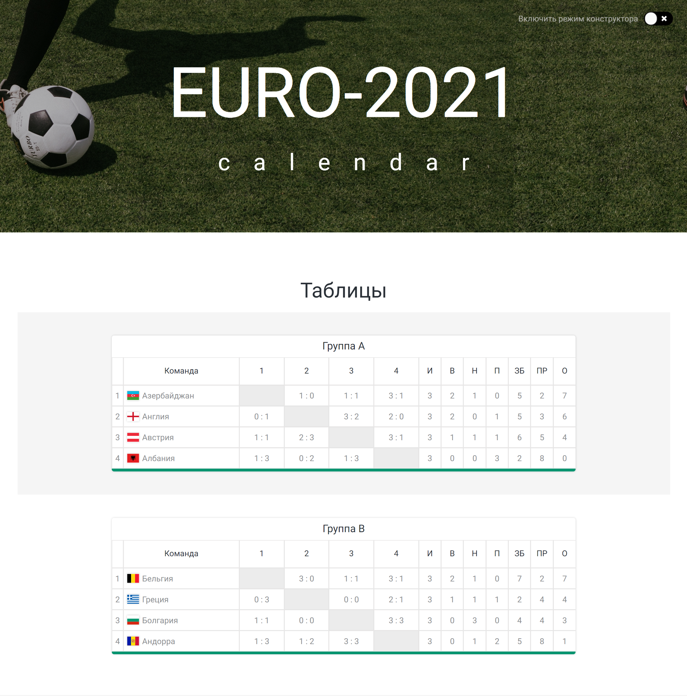

## General info

This is a football calendar for Euro Championship. It works as a constructor. The part with group games realised so far.
It works without any data base using local storage.

Note: during developing I needed some help.

## Technologies

Project is created with:

- React - version 17.0.2
- Node-sass - version 6.0.1
- Classnames - version 2.3.1

## Installation

Use
`npm install`
to setup project according to data from package.json

Tnen use
`npm start`
to run the app and to view it in the browser (http://localhost:3000).

## Screenshots

